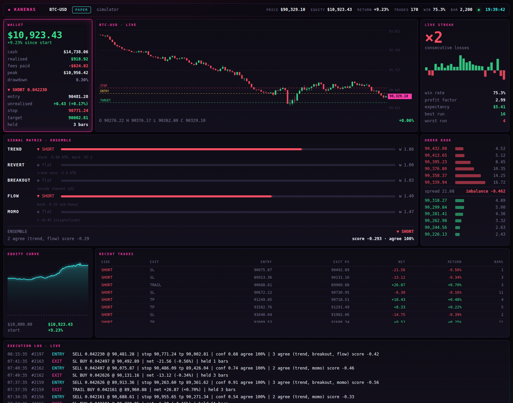

# Kanenas Trading Terminal

A multi-strategy, risk-managed crypto trading bot with live terminal and browser
dashboards. **Zero dependencies** — pure Python 3.9+ standard library.



```bash
python3 -m kanenas run --speed 8 --open      # live paper session + dashboards
python3 -m kanenas backtest --bars 5000      # full statistical report
python3 -m kanenas stress                    # try to break the strategy
python3 -m unittest discover -s tests        # 153 tests, ~3 seconds
```

---

## Read this before anything else

This bot **paper trades**. It simulates fills against a model of a real venue and
never places an order. `LiveBroker` exists but deliberately refuses to arm, and
raises `NotImplementedError` even when it does — wiring real order placement is a
decision you make explicitly, not something you inherit by running a demo.

The numbers below are from a **market simulator**, not from live trading. They
show the machinery works; they are not evidence of profit. Any bot that shows you
a 100% win rate is showing you a bug or a simulation — and the honest way to
prove that is [the stress suite](#does-it-actually-work), which makes this one
lose money on demand.

---

## Architecture

Data flows one way. Each layer knows only the layer beneath it, which is what
lets a strategy backtested on ten years of CSV run unchanged against a live feed.

```
     ┌──────────┐   Candle/OrderBook   ┌──────────────┐
     │   FEED   │ ───────────────────► │  INDICATORS  │   streaming, O(1)/bar
     └──────────┘                      └──────┬───────┘
   simulator │ REST │ CSV                     │
                                              ▼
                                      ┌───────────────┐
                                      │  5 STRATEGIES │  each → Signal(dir, conf)
                                      └───────┬───────┘
                                              ▼
                                      ┌───────────────┐
                                      │   ENSEMBLE    │  weighted blend + agreement
                                      └───────┬───────┘   weights adapt to realised P&L
                                              ▼
                                      ┌───────────────┐
                                      │     RISK      │  size, stops, kill switches
                                      └───────┬───────┘   ← the only place money is sized
                                              ▼
                                      ┌───────────────┐
                                      │    BROKER     │  spread + impact + latency + fees
                                      └───────┬───────┘
                                              ▼
                                      ┌───────────────┐
                                      │   PORTFOLIO   │  cash, position, trade ledger
                                      └───────┬───────┘
                                              ▼
                                 dashboards · backtest report
```

| Module | Responsibility |
|---|---|
| `core/types.py` | Domain objects: `Candle`, `OrderBook`, `Signal`, `Order`, `Fill`, `Position`, `Trade` |
| `core/indicators.py` | Streaming EMA, RSI, ATR, MACD, Bollinger, Donchian, realised vol |
| `data/simulator.py` | Regime-switching, GARCH-clustered, jump-diffusion market generator |
| `data/rest.py` | Live candles from Binance / Coinbase / Kraken |
| `data/replay.py` | CSV load/save for reproducible backtests |
| `strategy/*.py` | Five independent alpha models |
| `strategy/ensemble.py` | Blends signals; re-weights each model by its own realised P&L |
| `risk/manager.py` | Volatility-targeted sizing, ATR stops, kill switches, cost gate |
| `execution/broker.py` | Paper venue that charges you what a real one would |
| `execution/portfolio.py` | Mark-to-market accounting and the trade ledger |
| `engine.py` | The loop: bar → indicators → exits → signals → risk → order |
| `backtest.py` / `stress.py` | Metrics, Monte Carlo, adversarial scenarios |
| `ui/` | ANSI terminal dashboard + stdlib web dashboard |

## The five strategies

Each answers a different question, so their errors are less correlated than
running five variants of one idea.

| Strategy | Thesis | Fires when |
|---|---|---|
| `trend` | Crypto trends persist longer than a random walk allows | EMA 9/21/55 stacked, separation measured **in ATR** (a hairline cross is not a trend) |
| `revert` | Inside a range, price overshoots and snaps back | Bollinger z-score ≥ 1.8 **and** RSI confirms — with a **hard veto** when a trend is in force |
| `breakout` | Volatility clusters; a quiet market that breaks its range keeps going | Price clears the Donchian channel by a fraction of ATR, boosted when band width is in a squeeze |
| `flow` | At the shortest horizon, price moves toward the thinner side of the book | Smoothed order-book imbalance is *persistently* lopsided |
| `momo` | The **Sharpe** of recent returns beats the raw return as a momentum estimate | t-statistic of drift over 40 bars exceeds 1.1 |

### How the ensemble decides

Each strategy emits a signed conviction in `[-1, 1]`. The ensemble requires
**two** independent things:

- **Magnitude** — the weighted mean conviction must clear `entry_threshold`.
- **Agreement** — the share of participating weight on the winning side must
  clear `min_agreement`.

These are not redundant. One model screaming at 1.0 while three lean the other
way is a different trade from four models quietly nodding together, even when
the weighted means are identical.

**Weights then adapt.** Every closed trade is attributed back to the strategies
that voted for it, in proportion to their share of that vote. A rolling window
of attributed P&L becomes a bounded multiplier on each base weight, so a model
that stops working is quietly demoted instead of dragging the book down. The
bounds matter: unbounded adaptation is overfitting with extra steps.

## How risk actually works

`risk/manager.py` is the only file allowed to size a position — one file to
audit before trusting the bot with anything.

Sizing is **volatility-targeted**, not fixed-notional:

```
qty = (equity × risk_per_trade) / (atr_stop_mult × ATR)
```

A fixed dollar size bets far more in a violent market than a calm one without
you asking it to. This keeps the loss on a stop-out roughly constant in dollars
whatever volatility does. Then four kill switches, because what ends accounts is
not a bad trade but a bad *day* compounding:

- **max drawdown** — hard halt at −20% from peak, and a new day does *not* clear it
- **daily loss limit** — halt at −6% on the day, cleared at the next UTC day
- **loss-streak cooldown** — sit out N bars after consecutive losses
- **exposure cap** — notional ceiling, no accidental leverage
- **cost gate** — a setup's target must clear its own round-trip cost by 2.5×
  ([added in response to a stress failure](#the-bug-the-stress-suite-found))

## Why the backtester is deliberately pessimistic

Most published bot equity curves die on contact with a real venue for one
reason: they fill at the close price. Here every fill pays, in order —

1. **the spread** — buys lift the ask, sells hit the bid, always
2. **market impact** — square-root model against real top-of-book depth, so size
   costs more, and costs more when the book is thin
3. **latency drift** — price keeps moving between decision and fill
4. **taker fees** — basis points of notional

And exits are checked against each bar's **high and low, not its close**. A stop
2% away *is* hit by a wick that closes flat. When a bar contains both the stop
and the target, the engine assumes the **stop** — we cannot know which came
first, and assuming the target is the single most common way a backtest lies.

## Does it actually work?

On the simulator, yes. Across 24 independently seeded markets:

```
  Profitable runs            100.0%
  Return  p05/med/p95    +7.40% /  +11.52% /  +16.83%
  MaxDD   med/p95         1.14% /    1.50%
```

**Do not be impressed by that.** 24 for 24 is a warning sign, not a trophy: it
means the simulator is exploitable in ways a real market is not. So the repo
ships a suite whose job is to *break* the strategy:

```
  scenario         median    worst     best    win%   maxDD  trades   verdict
  Baseline          7.96%    4.18%   10.45%   72.0%   0.85%     206   survives
  Random walk      -3.45%   -5.16%   -2.89%   31.3%   3.55%      70   expected (costs, no edge)
  Whipsaw          -5.79%   -6.64%   -3.09%   30.6%   6.23%     114   BREAKS
  High fees         0.00%   -0.41%    0.00%    0.0%   0.00%       0   stood down (costs > edge)
  Thin book         0.09%   -1.41%    0.64%   80.0%   0.31%       5   survives
  Flash crashes     1.19%  -16.25%   28.02%   52.8%  12.93%      92   survives
  Brutal           -8.73%  -15.16%   -0.32%   37.8%   9.68%      24   BREAKS
```

Read it honestly:

- **Random walk −3.45% is the most important row in this repo.** Strip out drift
  and regime persistence and the bot loses roughly what it pays in costs —
  exactly right. A strategy that stays *profitable* on a driftless random walk is
  reading the future somewhere. This is the strongest evidence the engine isn't
  cheating.
- **Whipsaw and Brutal break it.** Trend logic dies when regimes flip every few
  bars. That is a real, named limitation, not a rough edge.
- **Flash crashes: median +1.19% but worst −16.25%.** Gap risk is real. A stop is
  a request, not a guarantee; price can open through it.
- **High fees: it stands down entirely.** Correct behaviour — flat beats bleeding
  to fees.

### The bug the stress suite found

The first stress run showed `High fees` at **−9.94% BREAKS**: raising the taker
fee from 5bp to 20bp flipped the book from +10% to −10%. The bot was firing
setups whose profit target barely covered the round trip.

The fix was a cost gate in `risk/manager.py` — a trade is only worth taking if
what it aims at clears what it costs to get in and out, by a margin. The gate is
derived from the **broker's own config** so risk and execution can never disagree
about what a trade costs. Result: `High fees` −9.94% → 0.00%, `Thin book`
−4.86% → +0.08%, `Brutal` −11.13% → −8.73%.

That is the loop this repo is built around: measure honestly, find the failure,
fix the cause.

## Testing

```bash
python3 -m unittest discover -s tests     # 153 tests, ~3s, no install needed
```

The tests that matter most are the ones that stop the bot lying about itself:

- **`test_decisions_do_not_depend_on_future_bars`** — run the engine over a
  prefix, then over the same prefix followed by a violent crash it never saw.
  Every decision inside the prefix must be byte-identical. This is the defining
  property of an honest backtest.
- **`test_equity_is_mark_to_market_not_cash_plus_pnl`** — regression for a real
  bug found during development (below).
- **`test_stop_is_triggered_by_the_bar_low_not_the_close`** — wicks count.
- **`test_when_stop_and_target_share_a_bar_the_stop_wins`** — pessimism is enforced.
- **`test_consistent_loser_is_demoted_despite_zero_variance`** — regression for
  the ensemble bug below.

### Three real bugs caught while building this

1. **Equity was `cash + unrealised_pnl`.** But `cash` already carries the full
   notional of every fill, so this double-counted the entry and reported money
   that did not exist while a position was open. It nets out once flat — which is
   exactly why a naive smoke test misses it. Correct definition is mark-to-market:
   `cash + qty × price`.

2. **A perfectly consistent loser scored neutral.** The ensemble weighted
   strategies by a t-statistic of attributed P&L. A strategy losing exactly −$40
   every trade has *zero variance*, so the unfloored t-stat read `0.0` and the
   weight never moved. Fixed with a dispersion floor.

3. **The breakout strategy could never fire.** The Donchian channel included the
   current bar, so a bar making a new high *became* the channel top — price could
   never be above it. `Donchian` now exposes `prev_upper`/`prev_lower`, the
   channel as it stood *before* the current bar.

## Usage

```bash
# Paper session with both dashboards (web at http://127.0.0.1:8787)
python3 -m kanenas run --speed 8 --open

# Live market data from a real venue — still paper fills, no real orders
python3 -m kanenas run --live --venue binance --symbol BTCUSDT --interval 1m

# Download candles once, then backtest against the same bytes forever
python3 -m kanenas fetch --venue binance --symbol BTCUSDT --bars 1000 --out data/btc.csv
python3 -m kanenas backtest --csv data/btc.csv --report reports/btc.json

# Tune risk
python3 -m kanenas backtest --risk 0.005 --stop-atr 2.5 --max-dd 0.15 --fee-bps 10

# Check your environment and which venues are reachable
python3 -m kanenas doctor
```

Key flags: `--risk` (fraction of equity per trade), `--stop-atr` / `--target-atr`,
`--max-dd`, `--threshold` (ensemble conviction needed), `--agreement`,
`--fee-bps`, `--min-edge` (cost gate), `--no-adaptive` (freeze weights),
`--no-shorts`, `--seed`. Full list: `python3 -m kanenas <command> --help`.

## Why no dependencies

Not minimalism for its own sake. A trading bot is code you have to *trust*, and
every dependency is a supply-chain surface and an install that can fail on the
machine you actually want to run it on. Everything here — the indicators, the
statistics, the ANSI dashboard, the web server — is standard library. Clone it
and it runs.

The one exception is `playwright`, an optional dev extra used solely to
screenshot the dashboard.

## Going live (if you ever do)

The engine is already broker-agnostic, so nothing about your strategy changes.
You would implement per-venue request signing in `LiveBroker.execute`, test it
against the venue's **testnet** first, and start with size small enough that
losing all of it changes nothing for you.

Before that, in order: backtest on real downloaded candles (not the simulator),
run `stress`, then paper trade on `--live` data for weeks and compare the paper
fills against what the venue would really have given you. Simulated edge that
does not survive that comparison is not edge.

Crypto trading carries real risk of total loss. This is engineering, not
financial advice.

## Licence

MIT
